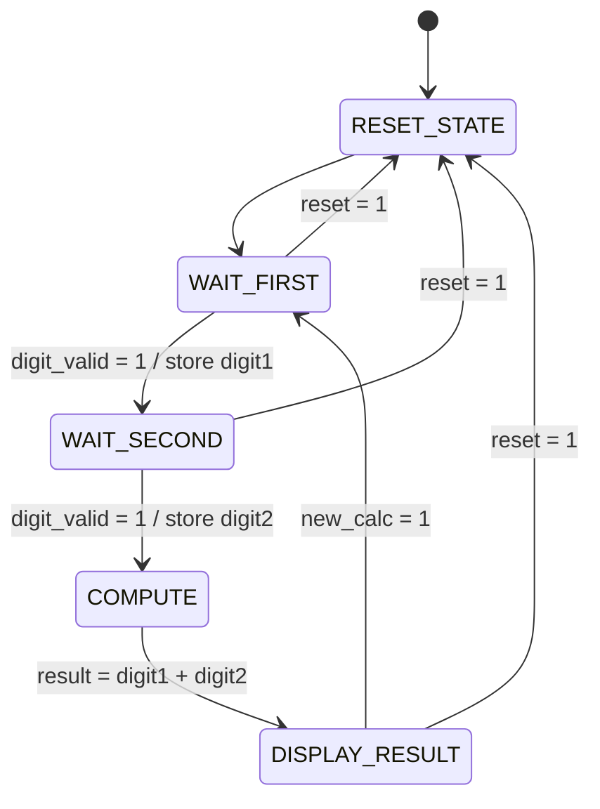

```mermaid
stateDiagram-v2
    [*] --> RESET_STATE

    RESET_STATE --> WAIT_FIRST

    WAIT_FIRST --> RESET_STATE : reset = 1
    WAIT_FIRST --> WAIT_SECOND : digit_valid = 1 / store digit1

    WAIT_SECOND --> RESET_STATE : reset = 1
    WAIT_SECOND --> COMPUTE : digit_valid = 1 / store digit2

    COMPUTE --> DISPLAY_RESULT : result = digit1 + digit2

    DISPLAY_RESULT --> RESET_STATE : reset = 1
    DISPLAY_RESULT --> WAIT_FIRST : new_calc = 1
```