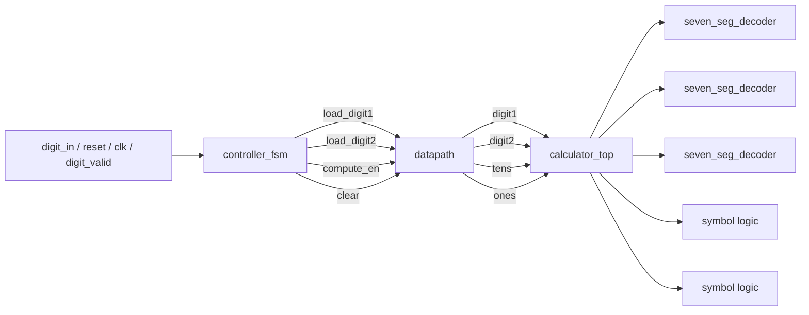

```mermaid
flowchart LR
    IN[digit_in / reset / clk / digit_valid] --> FSM[controller_fsm]
    FSM -->|load_digit1| DP[datapath]
    FSM -->|load_digit2| DP
    FSM -->|compute_en| DP
    FSM -->|clear| DP

    DP -->|digit1| TOP[calculator_top]
    DP -->|digit2| TOP
    DP -->|tens| TOP
    DP -->|ones| TOP

    TOP --> DEC1[seven_seg_decoder]
    TOP --> DEC2[seven_seg_decoder]
    TOP --> DEC3[seven_seg_decoder]
    TOP --> DEC4[symbol logic]
    TOP --> DEC5[symbol logic]
```