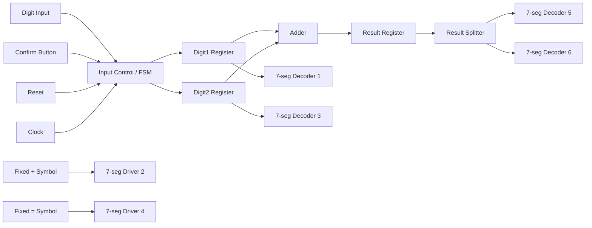

```mermaid
flowchart LR
    A[Digit Input] --> B[Input Control / FSM]
    C[Confirm Button] --> B
    D[Reset] --> B
    E[Clock] --> B

    B --> F[Digit1 Register]
    B --> G[Digit2 Register]

    F --> H[Adder]
    G --> H

    H --> I[Result Register]

    F --> J[7-seg Decoder 1]
    K[Fixed + Symbol] --> L[7-seg Driver 2]
    G --> M[7-seg Decoder 3]
    N[Fixed = Symbol] --> O[7-seg Driver 4]
    I --> P[Result Splitter]
    P --> Q[7-seg Decoder 5]
    P --> R[7-seg Decoder 6]
```